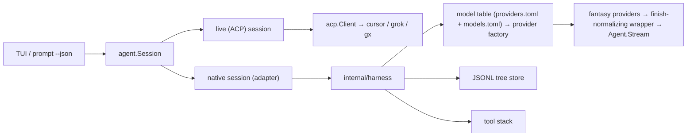

# 02 — Architecture

## The seam

craze's TUI never imports `internal/acp`. Everything flows through
`agent.Session` (`internal/agent/session.go`), the `Snapshot` and `Event`
types, and `agent.New(agent.Options{Provider: &p})`, which the three CLI
entry points (`internal/cli/tui.go`, `prompt.go`, `frame.go`) all call via
`tui.Config.NewSession`. The native harness is a second implementation of
that interface. The TUI, the queue, the cards, `craze prompt --json`, and the
frame runner do not change.



H0 accepted Fantasy `v0.43.2`'s providers. Its streamed `Agent.Stream` loop
dispatches and continues only when the finish reason is `tool-calls`, so a
complete tool call reported as `stop` would be dropped. H0 never saw that
live, and a small `LanguageModel` wrapper removes it, so H1 runs on
`Agent.Stream` behind that wrapper (D-21). The turn runner sits behind the
harness's own interface: a craze-owned `LanguageModel.Stream` loop remains an
option if `PrepareStep` proves too narrow, not a prerequisite. The catalog is
a small craze-owned model table rather than embedded Catwalk (D-22).

## Package split

Plan 018 §3.1 pins the concrete layout for H1:

```
internal/harness/             core; imports nothing from craze except internal/atomicfile
  modeltable/                 providers.toml + models.toml schemas, load, validate, resolve key
  gximport/                   pure gx-TOML → modeltable merge; no CLI, no I/O beyond the two source files
  llm/                        provider factory + the normalizing LanguageModel wrapper
  store/                      JSONL tree store
  (package harness)           Session: turn runner, steering, events, system prompt
internal/agent/native.go      the adapter: harness.Session → agent.Session
internal/agent/provider.go    NativeProvider(), hidden, inProcess
internal/cli/import.go        `craze import gx`
```

| package | owns | must not import |
|---|---|---|
| `internal/harness` (and every subpackage) | model table (`modeltable`), gx import (`gximport`), Fantasy provider factory + finish-normalizing wrapper (`llm`), JSONL tree store (`store`), turn runner, prompt assembly | `internal/agent`, `internal/tui`, `internal/acp`, `internal/cli`, `internal/sessions`, `internal/host`, `internal/paths` |
| `internal/agent/native.go`, `internal/agent/provider.go` | the adapter: `Provider` constructor for `native` (hidden, in-process), `Session` implementation that maps harness callbacks onto `Event`/`Snapshot` | — |
| `internal/cli/import.go` | the `craze import gx` subcommand entry, flag plumbing only (`--provider native`) | — |

A **depguard** rule enforces the `internal/harness` import list in `make
lint`, extending the boundary check that already exists for `internal/tui`
and `internal/cli` against `internal/acp`. The harness receives its
directory as `Options.Home`; the adapter passes `paths.NativeDir()`.
`internal/atomicfile` is allowed because it is dependency-free; if a later
split needs it, it moves with the harness. Tools, permissions, and
compaction (H2 onward) land inside `internal/harness` too but are not part
of H1.

The rule that matters: **`internal/harness` knows nothing about craze
types.** It exposes its own small event and request types. That is what
keeps a later ACP server binary a wrapper rather than a rewrite, and what
lets the harness be tested with a scripted Fantasy `LanguageModel` instead
of a fake agent process.

## The turn loop

The loop follows the shape opencode, grok, and pi converged on, run through
Fantasy's `Agent.Stream` the way crush does:

1. **Re-read history from the store every iteration.** No in-memory
   conversation across steps. Queued messages, interject, resume, and
   compaction all fall out of this.
2. **Build the prompt**: system prompt (assembled once per session, see
   `06`), instruction files, skill catalog, then the message list from the
   store's leaf-to-root walk with the latest compaction applied.
3. **Drain steering** (interject) into the message list at this safe point;
   this is Fantasy's `PrepareStep` hook, which H0 verified replaces history
   without duplicating tool-call pairs. **H1 has no tool steps, so there is
   no safe point to drain into; interject arrives in H2 with this hook**
   (D-34).
4. **Compact if needed** before sampling (`03`, `07`).
5. **`Agent.Stream`** with callbacks: text delta → text event, reasoning
   delta → thought event, tool input start/delta/end and tool call/result →
   tool event (merged by id), step finish → usage, stream finish → done.
6. **Continue on parts, not finish reason.** The wrapper under the agent
   rewrites a `stop` finish to `tool-calls` when the step carried complete
   tool calls (Fantasy's providers already suppress truncated ones), and
   turns an empty `stop` step with no content and no usage into an error:
   that is how Meta reports reasoning that exhausted the output ceiling
   (D-25). `length`, content-filter, and error finishes are left alone so
   Fantasy keeps refusing to dispatch possibly truncated calls.
7. **Guard execution**: three consecutive identical tool calls (name +
   input) raise a doom-loop permission ask; a `length` stop with tool calls
   fails the calls rather than executing possibly truncated arguments (D-07).
8. **Cancel** through context cancellation. In-flight tool calls are closed
   as errored results marked interrupted so every tool call has a result on
   replay. If the turn produced no output, the prompt is put back on the
   queue (grok's rewind).
9. **Drain follow-ups** after the turn through craze's existing queue. The
   harness does not own the TUI queue.

The wrapper is about 40 lines plus four fixture tests (the review follow-up
in Plan 016's artifact directory has a working copy). H0 sized the
alternative, a craze-owned direct-stream loop, at roughly 1.5–2.5 kLOC plus
comparable fixtures.

## Tool stack

Every tool is a Fantasy `AgentTool` wrapped in this order, innermost first:

1. the tool itself (read, bash, edit, …)
2. **kind metadata** — attaches grok's `x.ai/tool` vocabulary (kind,
   namespace, read_only, canonical input) so craze's cards key on kind
   unchanged (`05`)
3. **truncation** — full output to disk, head/tail preview plus path
4. **permission** — asks through the session, honours grants, removed
   entirely under `Force` (yolo)
5. (later) hooks, MCP — same wrapper shape, not built now

Modes filter which tools are active and add a prompt reminder; plan mode is
additionally enforced in the dispatcher so it survives yolo (`05`).

## Home directory

**Per D-27.** Everything, TUI config included, lives under `~/.craze/`. One
environment variable, `CRAZE_HOME`, relocates the whole directory;
`CRAZE_CONFIG` is removed. The harness gets its own subdirectory, `native/`,
rather than a sibling home:

```
~/.craze/                 0700
  config.toml             unchanged; the TUI's read-modify-write file
  sessions.jsonl          unchanged; the shared session index
  native/                 0700
    providers.toml        0600; endpoints, env var names, inline keys. Secrets live only here
    models.toml           0644; aliases, wire ids, limits, efforts. No secrets: safe to paste or share
    sessions/<cwd-slug>/<UTC yyyymmddThhmmssZ>_<session-id>.jsonl
```

`native/providers.toml` and `native/models.toml` are H1 (`03`, `04`). Later
phases add their own files under `native/` and are **not yet designed**:
`native/permissions/<cwd-slug>.toml` (H3), an imported-content tree for
Claude compat (H4, shape not yet committed — `06`'s paths are a sketch
inherited from before this rewrite), a plan-mode file per session (H5).
`CRAZE_HOME` relocates only the craze directory's contents; user-level
skills and plugin caches stay keyed off `$HOME` (`agent.HomeDir()`), exactly
as `CRAZE_CONFIG` never moved them.

## Testing pattern

- **Unit**: a scripted Fantasy `LanguageModel` returns canned text,
  reasoning, tool calls, finish reasons, usage, warnings, and in-band errors.
- **Wire**: local canned server-sent events exercise Fantasy's released
  provider normalization; a small reviewed cassette set may be added only
  where a real provider shape cannot be represented locally.
- **Golden**: the existing TUI frame and golden tests run against the native
  session with the scripted model.
- **Live**: each phase ends with a tmux smoke on the mac-mini against real
  providers (see the `craze-tmux-live-smoke` memory for the procedure).

## Capabilities

The adapter fills `agent.Capabilities` per phase so the TUI hides what the
harness cannot do yet instead of drawing empty surfaces:

| capability | phase it turns on |
|---|---|
| Effort (model/effort options) | H1 |
| Interject | H2 (D-34) |
| Modes | H5 (D-34) |
| Todos, AskCards, PlanCards | H5 |
| SubagentRows, SubagentTranscript | H6 |
| FastToggle | never (cursor-only) |
