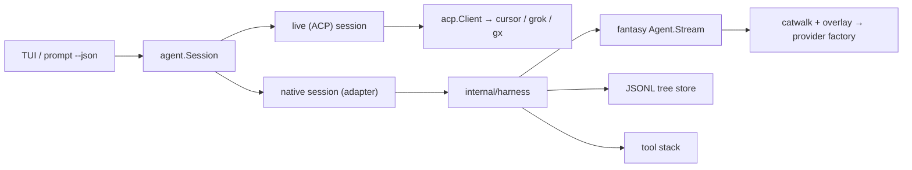

# 02 — Architecture

## The seam

craze's TUI never imports `internal/acp`. Everything flows through
`agent.Session` (`internal/agent/session.go`), the `Snapshot` and `Event`
types, and `agent.New(agent.Options{Provider: &p})`, which the three CLI
entry points (`internal/cli/tui.go`, `prompt.go`, `frame.go`) all call via
`tui.Config.NewSession`. The native harness is a second implementation of
that interface. The TUI, the queue, the cards, `craze prompt --json`, and the
frame runner do not change.



## Package split

| package | owns | must not import |
|---|---|---|
| `internal/harness` | catalog, provider factory, turn runner, tools, permissions, store, compaction, prompt assembly, import command logic | `internal/agent`, `internal/tui`, `internal/acp` |
| `internal/agent` (new file, e.g. `native.go`) | the adapter: `Provider` constructor for `native`, `Session` implementation that maps harness callbacks onto `Event`/`Snapshot` | — |
| `internal/cli` | flag plumbing only (`--provider native`), the `import` subcommand entry | — |

The rule that matters: **`internal/harness` knows nothing about craze
types.** It exposes its own small event and request types. That is what
keeps a later ACP server binary a wrapper rather than a rewrite, and what
lets the harness be tested with a scripted fantasy `LanguageModel` instead
of a fake agent process.

## The turn loop

Copied from what opencode, grok, and pi all converged on:

1. **Re-read history from the store every iteration.** No in-memory
   conversation across steps. Queued messages, interject, resume, and
   compaction all fall out of this.
2. **Build the prompt**: system prompt (assembled once per session, see
   `06`), instruction files, skill catalog, then the message list from the
   store's leaf-to-root walk with the latest compaction applied.
3. **Drain steering** (interject) into the message list at this safe point;
   this is fantasy's `PrepareStep` hook.
4. **Compact if needed** before sampling (`03`, `07`).
5. **`Agent.Stream`** with callbacks: text delta → `EventText`, reasoning
   delta → `EventThought`, tool input start/delta/end and tool call/result →
   `EventTool` (merged by id), step finish → usage, stream finish → done.
6. **Exit on parts, not finish reason.** Some providers return `stop` with
   tool calls present. The turn ends when the last assistant step has no
   unfinished tool calls and did not request more.
7. **Guards**: three consecutive identical tool calls (name + input) raise a
   doom-loop permission ask; a `length` stop with tool calls fails the calls
   rather than executing truncated arguments (pi's rule, D-07).
8. **Cancel**: context cancellation. In-flight tool calls are closed as
   errored results marked interrupted so every tool call has a result on
   replay. If the turn produced no output, the prompt is put back on the
   queue (grok's rewind).
9. **Follow-ups**: after the turn, the TUI drains craze's own queue exactly
   as it does for grok today; the harness does not drive the queue.

## Tool stack

Every tool is a fantasy `AgentTool` wrapped in this order, innermost first:

1. the tool itself (read, bash, edit, …)
2. **kind metadata** — attaches grok's `x.ai/tool` vocabulary (kind,
   namespace, read_only, canonical input) so craze's cards key on kind
   unchanged (`05`)
3. **truncation** — full output to disk, head/tail preview plus path
4. **permission** — asks through the session, honours grants, removed
   entirely under `Force` (yolo)
5. (later) hooks, MCP — same wrapper shape, not built now

Modes filter which tools are active (`ActiveTools`) and add a prompt
reminder; plan mode is additionally enforced in the dispatcher so it
survives yolo (`05`).

## Home directory

Default `~/.craze-acp/`, overridden by one environment variable
(`CRAZE_ACP_HOME`; name is D-05). Layout:

```
~/.craze-acp/
  config.toml          provider overlay, aliases, compat toggles
  instructions/        imported global CLAUDE.md / AGENTS.md
  skills/              imported user skills
  agents/              imported agent definitions
  plugins/<id>/        imported plugin snapshots + manifest.json (source, sha)
  sessions/<cwd>/<id>.jsonl
  permissions/<cwd>.toml
```

craze's own TUI config stays at `~/.craze/config.toml` (`CRAZE_CONFIG`)
unless `10-open-questions.md` Q1 is resolved otherwise.

## Testing pattern

- **Unit**: a scripted `fantasy.LanguageModel` that returns canned text,
  reasoning, and tool calls replaces `craze-fake-agent` for the native path.
- **Wire**: fantasy's `charm.land/x/vcr` records live provider cassettes for
  the few tests that must see real SSE.
- **Golden**: the existing TUI frame and golden tests run against the native
  session with the scripted model.
- **Live**: each phase ends with a tmux smoke on the mac-mini against real
  providers (see the `craze-tmux-live-smoke` memory for the procedure).

## Capabilities

The adapter fills `agent.Capabilities` per phase so the TUI hides what the
harness cannot do yet instead of drawing empty surfaces:

| capability | phase it turns on |
|---|---|
| Effort, Modes (model/effort options) | H1 |
| Interject | H1 |
| Todos, AskCards, PlanCards | H5 |
| SubagentRows, SubagentTranscript | H6 |
| FastToggle | never (cursor-only) |
