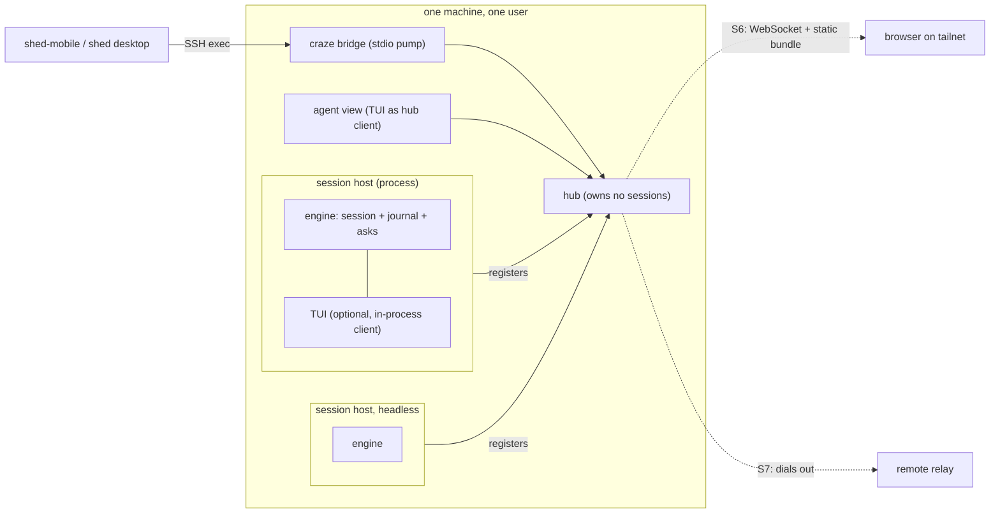

# 02 — Architecture

## The pieces



| piece | what it is | owns |
|---|---|---|
| **Session host** | One OS process per session. Today's `craze` is a host with a TUI attached in-process; `craze serve` (S4) is the same host with none. | The `agent.Session`, the agent child process, the journal, pending asks, its own socket |
| **Hub** | One small per-user process at a fixed socket path, auto-spawned, exits when idle. | A roster of hosts, routing of client connections to them, spawning headless hosts. **No sessions.** |
| **Client** | Anything speaking the protocol (`05`): the TUI, `craze attach`, the agent view, `shed-craze`, a browser. | Its own view state and drafts only |
| **Bridge** | `craze bridge`: stdin/stdout pumped to the right local socket. | Nothing. It is the stable entry point for SSH clients (SD-05). |

## Why process-per-session and a thin hub (SD-02)

The alternative is a prox-style daemon holding every session as a goroutine.
It was rejected because:

- A daemon crash or upgrade kills every running agent. With hosts, the hub
  can die or be replaced and sessions keep running, then re-register.
- The agents are already processes (`cursor-agent`, `grok`, `gx`). In-process
  native sessions would share one failure domain: one panic, all sessions.
- prox's daemon has to demand exact binary version equality on its socket
  (`internal/proxyd/daemon.go`, `VersionMismatchError`). A hub that only
  routes frames needs one protocol-version integer.
- Nothing in craze's engine is a singleton, but process-wide state is:
  `CRAZE_HOME`, `$HOME`-keyed skill and plugin caches, signal handling. A
  process per session keeps those honest.

What the hub buys over bare per-session sockets: one roster subscription
instead of N connections, one stable path, a place to spawn headless hosts,
and, later, one outbound uplink per machine rather than per session.

**Sequencing (SD-06):** per-session sockets ship first (S2); the hub arrives
with headless hosts (S4) and speaks the identical protocol. Every
session-scoped method carries a `sessionId` from day one, so a per-session
socket is simply a hub whose roster has one row. `craze bridge` hides which of
the two it dialed, so `shed-craze` never changes.

## Paths

```
$CRAZE_HOME/run/                 0700
  hub.sock                       0600   S4
  hub.pid                        flock singleton, prox's pattern
  host/<session-id>.sock         0600   S2
$CRAZE_HOME/journal/<cwd-slug>/<utc>_<session-id>.jsonl   0600   S1 (SQ1)
```

Stale sockets are detected by connect failure and unlinked by the next host
or hub that finds them; a host removes its own socket on exit, including the
`SIGHUP` path added in plan 017.

## Local trust model (SD-04)

The boundary is **same uid on this machine**: a `0700` directory, `0600`
sockets, and a peer-credential uid check on accept (`SO_PEERCRED` on Linux,
`LOCAL_PEERCRED` on macOS). Logging in over SSH as the owner *is* the
authorization, exactly as for roost (`epics/roost-pivot.md`: "UDS + SSH. No
network listener, no auth layer").

This is the main thing done differently from the gx lane. Loopback TCP has no
peer identity, so gx needs a token file with `O_EXCL`/`O_NOFOLLOW`/mode
discipline, a discovery record, `healthz` + `instanceId` pinning against port
recycling, an SSH probe script, and a roost metadata hint that goes stale and
cannot be cleared. None of those exist here.

Within that boundary the gate is the **session's own state**, published as a
verb × activity table in the spec (`05`), which is gx's framing and worth
keeping: credentials are provenance, state is the gate.

## The remote direction (S6, S7 — not committed)

- **S6, `craze web`:** the hub serves the protocol over WebSocket and a static
  bundle, bound to loopback or a tailnet address only. This is t3code's
  direct/Tailscale route: "bring your own network", no relay, no accounts.
  Binding rules can copy prox's listen-address classifier
  (`internal/proxyd/hub.go`): loopback or a point-to-point tunnel interface,
  never `0.0.0.0`.
- **S7, relay:** the hub dials **out** to a remote server and republishes the
  same protocol, so NAT and containers work. From prox: HTTP/1.1 `Upgrade`
  then a hijacked connection, generation-counted sessions, lease-based
  liveness with a reconnect grace, one goroutine owning the connection state
  machine, and a never-fatal posture (a dead relay costs one warning).
  **Not** from prox: its control plane on a second connection, its single
  shared bearer token, and origin strings asserted by the client.
- **Transport (SD-13):** session-tagged frames over one WebSocket first. It
  passes through proxies and TLS terminators and leaves the server language
  open. yamux earns its place only when raw byte streams (terminals, port
  forwards) need per-stream flow control; it can run inside the WebSocket.
- **Server (SD-14):** Go first, sharing the protocol package. The protocol is
  specified by JSON Schema, fixtures, and a fake (`05`), and `shed-craze` is a
  Rust client from S3, so a non-Go implementation is proven possible early.

**Security posture for anything remote.** Remote control of a coding agent is
remote code execution by design. Requirements recorded now so the protocol
does not preclude them: per-machine enrollment with a machine key (no shared
token); TLS always; scopes at least `observe` / `operate` / `approve`
(SQ11); a **capability allow-list enforced on the craze side** (SD-16, prox's
D11: the controlled end decides what is invocable); remote access opt-in per
machine and visible in the TUI while a remote client is attached; a separate
positive-list of methods for remote clients rather than "local minus some".

## What stays where

| concern | lives in | must not |
|---|---|---|
| Session lifecycle, asks, turn state, transcript model, journal | the engine, `internal/agent` and new packages beside it | import `internal/tui` |
| Protocol types, schema, encode/decode | a new package with no UI or engine imports | reach into `internal/agent` internals; it maps from `agent.Event` |
| Socket server, hub, bridge | new packages under `internal/` | hold session semantics |
| Rendering, keymap, composer, dialogs | `internal/tui` | hold state two clients must agree on |

The lint-enforced boundary that keeps `internal/harness` ignorant of craze
(`discovery/native-harness/02-architecture.md`) is unchanged (SD-08).
