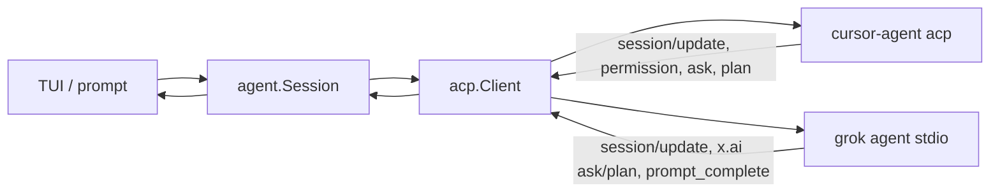

# Architecture

craze is an ACP client. It owns the chrome; `cursor-agent`, `grok`, or `gx`
(or `craze-fake-agent` in tests) is the agent process. `gx` is a third-party
fork of the Grok CLI that speaks the same ACP dialect as `grok` — see
[Configuration](../reference/configuration.md#provider-precedence) — so on
the wire a gx session *is* a grok session and the diagram below has no
separate node for it.

## Packages

| Package | Role |
|---------|------|
| `internal/acp` | JSON-RPC over stdio: spawn, framing, `session/new`, prompt, and the blocking agent→client requests (permission, question, plan) |
| `internal/agent` | Session wrapper: events, tool merge, todos, model/mode catalog |
| `internal/tui` | Bubbletea screen: transcript, cards, composer, themes, slash, mouse |
| `internal/cli` | Cobra: default TUI, `prompt`, hidden `frame`, `version` |
| `internal/textdiff` | Diff hunks for edit tools |
| `cmd/craze-fake-agent` | Scripted ACP stdio server (`echo`, `todos`, `diff`, `ask`, `plan`, …) |

## Session

`agent.Session` starts the child, then exposes a stream of events the TUI and
`craze prompt --json` both consume:

| Event | Meaning |
|-------|---------|
| `text` / `thought` | Streaming assistant output; `Event.Agent` names the sub-agent when the line belongs to one |
| `tool` | Tool call create/update (merged by id, per session for a child) |
| `user` | A chunk of a sub-agent's prompt (always carries `Agent`) |
| `subagent` | Sub-agent lifecycle: spawned / progress / finished |
| `todos` | Cursor todo list replace or merge |
| `permission` / `question` / `plan` | Blocking card |
| `done` / `error` | Turn finished |
| `meta` | Session snapshot (models, modes, commands, title) |

The TUI turns those events into transcript rows, the tasks panel, status
rows, and cards. `craze prompt --json` writes the same events as JSON lines.

Grok runs its own sub-agents and reports them: lifecycle notifications
(`subagent_spawned` / `-progress` / `-finished`) arrive on the parent session
while the child's own `session/update` stream arrives on the same stdio under
the child's session id. The ACP client keeps an allowlist of child session
ids — registered on `spawned`, dropped after `finished`, capped — and tags
every forwarded update with the child id (`SessionNotification.Child`), so
routing never depends on a session id the session layer holds. `agent.Session`
keeps the per-child state (tools, prompt, progress counters) behind one
`SubagentInfo` list on the snapshot; the TUI keeps one transcript per child
and shows it read-only in the sub-agent view. Cursor has no child stream —
the session synthesizes the same records from `cursor/task` receipts.

## Fake agent

`craze-fake-agent` stands in for `cursor-agent acp` or `grok agent stdio`.
Unknown arguments (including `acp`, `--force`, `agent`, `stdio`, and
`--always-approve`) are ignored so the binary can be pointed at with
`--agent-bin`. Scripts are selected with `-script` or `CRAZE_FAKE_SCRIPT`.
Grok scripts are prefixed `grok-`. See [Testing](testing.md).
