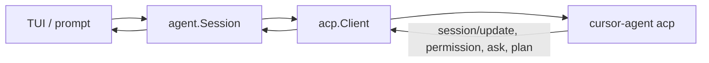

# Architecture

craze is an ACP client. It owns the chrome; `cursor-agent` (or
`craze-fake-agent` in tests) is the agent process.

## Packages

| Package | Role |
|---------|------|
| `internal/acp` | JSON-RPC over stdio: spawn, framing, `session/new`, prompt, and the blocking agent→client requests (permission, question, plan) |
| `internal/agent` | Session wrapper: events, tool merge, todos, model/mode catalog |
| `internal/tui` | Bubbletea screen: transcript, cards, composer, themes, slash, mouse |
| `internal/cli` | Cobra: default TUI, `prompt`, hidden `frame`, `version` |
| `internal/textdiff` | Diff hunks for edit tools |
| `cmd/craze-fake-agent` | Scripted ACP stdio server (`echo`, `todos`, `diff`, `ask`, `plan`, …) |

## Session

`agent.Session` starts the child, then exposes a stream of events the TUI and
`craze prompt --json` both consume:

| Event | Meaning |
|-------|---------|
| `text` / `thought` | Streaming assistant output |
| `tool` | Tool call create/update (merged by id) |
| `todos` | Cursor todo list replace or merge |
| `permission` / `question` / `plan` | Blocking card |
| `done` / `error` | Turn finished |
| `meta` | Session snapshot (models, modes, commands, title) |

The TUI turns those events into transcript rows, the tasks panel, status
rows, and cards. `craze prompt --json` writes the same events as JSON lines.

## Fake agent

`craze-fake-agent` stands in for `cursor-agent acp`. Unknown arguments
(including `acp` and `--force`) are ignored so the binary can be pointed at
with `--agent-bin`. Scripts are selected with `-script` or
`CRAZE_FAKE_SCRIPT`. See [Testing](testing.md).
