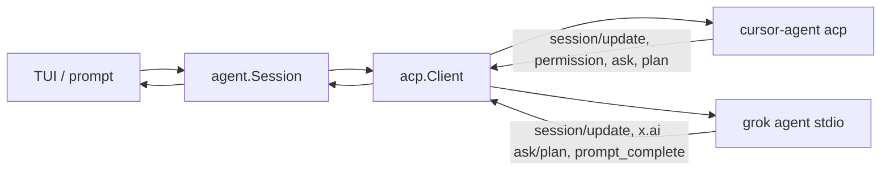
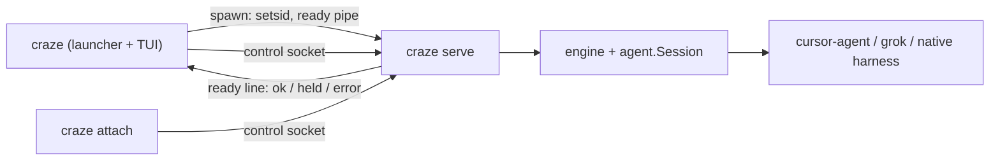

# Architecture

craze is an ACP client. It owns the chrome; `cursor-agent`, `grok`, or `gx`
(or `craze-fake-agent` in tests) is the agent process. `gx` is a third-party
fork of the Grok CLI that speaks the same ACP dialect as `grok` — see
[Configuration](../reference/configuration.md#provider-precedence) — so on
the wire a gx session *is* a grok session and the diagram below has no
separate node for it.

```mermaid
flowchart LR
  tui["TUI / prompt"] --> session["agent.Session"]
  session --> client["acp.Client"]
  client --> cursor["cursor-agent acp"]
  client --> grok["grok agent stdio"]
  cursor -->|"session/update, permission, ask, plan"| client
  grok -->|"session/update, x.ai ask/plan, prompt_complete"| client
  client --> session
  session --> tui
```

## Packages

| Package | Role |
|---------|------|
| `internal/acp` | JSON-RPC over stdio: spawn, framing, `session/new`, prompt, and the blocking agent→client requests (permission, question, plan) |
| `internal/agent` | Session wrapper: events, tool merge, todos, model/mode catalog |
| `internal/backend` | The TUI's seam onto a session (plan 027 §3.12): the `Backend` interface, `Item`, `SessionInfo`, the epoch sentinels (`ErrStaleEpoch`, `ErrOutcomeUnknown`) both the in-process and socket implementations share |
| `internal/tui` | Bubbletea screen: transcript, cards, composer, themes, slash, mouse; a command gate carries almost every engine call onto a `Backend` (in process, or over the socket for `craze attach`) — a hidden ask's answer and a sub-agent stop are the exceptions, fire-and-forget `tea.Cmd`s that are never gated |
| `internal/protocol` | The control-socket wire, protocol 1 (plan 027 §3.2–§3.4): envelope, methods, notifications, codes, reasons, limits and the JSON Schema — the one place `internal/control`, `internal/remote` and `internal/fakehost` take their shapes from |
| `internal/control` | The control socket's server (plan 027 §3.7): connections, `hello`, the binding table, command handlers, attach and forwarding, run by any process that serves a session: a detached `craze serve` by default (plan 030), the TUI's own process when detaching is off |
| `internal/remote` | The control socket's Go client (plan 027 §3.14): `remote.Session` implements `backend.Backend` over the wire — dial, resume, the reply barrier, reconnect and resend rules — for `craze attach` and `internal/tui`'s socket-transport frame goldens |
| `internal/roster` | The session list's data (plan 030 §3.9): a poller over this user's host registry — one kept, never-reconnecting connection per host, asked `sessions.list` once a second within a budget, backing off from a host that does not answer — and this `CRAZE_HOME`'s session index for the saved sessions; the TUI reads its latest snapshot (`tui.Config.Sessions`) |
| `internal/rundir` | Where a craze host puts what other processes must reach: the runtime namespace (the socket), and the registry, host locks, session locks, host logs and the model catalog cache under `~/.cache/craze/` (plus the process identity the launcher's last-resort agent kill checks) |
| `internal/modelcache` | The model catalog cache (plan 030 §3.14): one file per ACP provider holding the models its agent last installed, written by `craze serve` under a per-provider lock that keeps the newest observation, read by the session list's `/model` |
| `internal/fakehost` | The in-process twin of `cmd/craze-fake-host`: a scripted control-socket server for wire fixtures and tests |
| `internal/cli` | Cobra: default TUI (the launcher), `prompt`, `bridge`, `attach`, `serve` (the detached host), hidden `frame`, `version` |
| `internal/textdiff` | Diff hunks for edit tools |
| `cmd/craze-fake-agent` | Scripted ACP stdio server (`echo`, `todos`, `diff`, `ask`, `plan`, …) |
| `cmd/craze-fake-host` | Scripted control-socket server, driven by the same wire fixtures as `internal/fakehost` |

## Session

`agent.Session` starts the child, then exposes a stream of events the TUI and
`craze prompt --json` both consume:

| Event | Meaning |
|-------|---------|
| `text` / `thought` | Streaming assistant output; `Event.Agent` names the sub-agent when the line belongs to one |
| `tool` | Tool call create/update (merged by id, per session for a child) |
| `user` | A chunk of a sub-agent's prompt (always carries `Agent`) |
| `subagent` | Sub-agent lifecycle: spawned / progress / finished |
| `todos` | Cursor todo list replace or merge |
| `permission` / `question` / `plan` | Blocking card |
| `done` / `error` | Turn finished |
| `meta` | Session snapshot (models, modes, commands, title) |

The TUI turns those events into transcript rows, the tasks panel, status
rows, and cards. `craze prompt --json` writes the same events as JSON lines.

Grok runs its own sub-agents and reports them: lifecycle notifications
(`subagent_spawned` / `-progress` / `-finished`) arrive on the parent session
while the child's own `session/update` stream arrives on the same stdio under
the child's session id. The ACP client keeps an allowlist of child session
ids — registered on `spawned`, dropped after `finished`, capped — and tags
every forwarded update with the child id (`SessionNotification.Child`), so
routing never depends on a session id the session layer holds. `agent.Session`
keeps the per-child state (tools, prompt, progress counters) behind one
`SubagentInfo` list on the snapshot; the TUI keeps one transcript per child
and shows it read-only in the sub-agent view. Cursor has no child stream —
the session synthesizes the same records from `cursor/task` receipts.

## Host and client

The session does not live in the terminal's process.
`craze serve` is the **host**: it owns the engine, the agent process, the
claim on the session, the journal and the session-index writes, and serves the
session over the control socket. The ordinary `craze` is a **launcher** and
its TUI a **socket client** — the same `remote.Session` a `craze attach` uses,
behind `backend.Backend`, so the TUI cannot tell a host it spawned from one it
found. Closing the terminal closes a client, not the session.

```mermaid
flowchart LR
  launcher["craze (launcher + TUI)"] -->|"spawn: setsid, ready pipe"| host["craze serve"]
  host -->|"ready line: ok / held / error"| launcher
  launcher -->|"control socket"| host
  attach["craze attach"] -->|"control socket"| host
  host --> engine["engine + agent.Session"]
  engine --> agentproc["cursor-agent / grok / native harness"]
```

**The spawn handshake.** The launcher mints a host id and starts `craze
serve` with stdio on `/dev/null`, its own session (`setsid`), and a pipe on
which the host writes one JSON line once its registry entry carries the
session's identity: `ok` (host id, socket, craze session id, version), or not
ok with an `error`, marked `refused` when the session *asked for* was the
problem (no such row, a spawn flag the provider cannot take), or `held` (with
the holder's id and pid) when another craze already has the session. The pipe
is private to the two processes; it is not part of the control protocol. A
`held` answer is followed to the holder — the launcher attaches to it — and a
host that fails to answer is stopped or terminated, never left running unowned. Before spawning,
the launcher looks for a live registry entry that already serves the session
and attaches to it directly; an attach that succeeds is committed to, one that
fails (a stopping host's `closing`, a start failure) falls back to the spawn.

**The lifecycle coordinator.** A host has one stop sequence, run once on the
host's own goroutine: a `host_stop` note in the journal (why it stopped), the
attach fence, the engine's close, the control server's close order, the
start's join (bounded), then the claims and the agent record are released.
`session.stop`, SIGINT/SIGTERM and the idle watcher only *request* it. A host
that cannot join its start in time kills the agents it recorded itself
(each record is a process-group id plus the leader's start time, so a group
whose leader had already been reused when checked is not signalled; a short
race remains between that check and the signal — SF-81); the launcher does the same for a host it had to give
up on.

**The idle fence.** The idle watcher looks once a second; when its clock
(`host_idle_exit`) has run out it raises two fences — the server's attach
fence and the engine's admission fence — and only then counts attachments and
whatever is in flight. Nothing: the stop, fences left up. Anything: both are
released and the clock restarts. So a client that attaches, or a command that
is admitted, at that instant is either counted or refused with `closing`
(protocol code `unavailable`), never accepted into a session already ending.
A native session's owed background work counts as in flight; an ACP agent has
no admission fence and could start a turn of its own after the verdict (the
stop's close ends it).

**The opt-out.** `detach = false`, `CRAZE_DETACH=0`, or the control socket off
keep the older path: `runTUI` builds the engine in the TUI's own process, binds
its own socket when the control socket is enabled, and closes the session with the terminal. Both paths are kept
under test (`tests/cli` runs its core cases detached and in process); the
choice is `detachOn` in `internal/cli/launch.go`. See
[Configuration](../reference/configuration.md#detached-hosts).

## Fake agent

`craze-fake-agent` stands in for `cursor-agent acp` or `grok agent stdio`.
Unknown arguments (including `acp`, `--force`, `agent`, `stdio`, and
`--always-approve`) are ignored so the binary can be pointed at with
`--agent-bin`. Scripts are selected with `-script` or `CRAZE_FAKE_SCRIPT`.
Grok scripts are prefixed `grok-`. See [Testing](testing.md).
